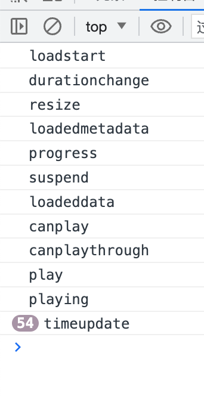

# @swnb/event

> pub/sub module implement with typescript

## install

```shell
npm install @swnb/event
# or
yarn add @swnb/event
# or
pnpm i @swnb/event
```


## why we need another event module


### three reason why you should use this module

#### 1. simplify event binding

in `react` , you have to write code like this to bind event

```tsx example.tsx
useEffect(() => {
  const callback = () => {}

  target.addEventListener("event", callback)

  return () => {
    target.removeEventListener("event", callback)
  }
}, [target])
```

if you want to bind multiple events, you will have to do this

```tsx example.tsx
useEffect(() => {
  const callback1 = () => {}
  target.addEventListener("event1", callback1)

  const callback2 = () => {}
  target.addEventListener("event2", callback2)

  // ....

  return () => {
    target.removeEventListener("event1", callback1)
    target.removeEventListener("event2", callback2)
    // ....
  }
}, [target])
```

when you use `@swnb/event`

```tsx example.tsx
import { EventProxy } from "@swnb/event"
useEffect(
  () =>
    EventProxy.new(target)
      .on("event1", (...args) => {}) // support type hint !
      .on("event2", (...args) => {}) // support type hint !
      .on("event3", (...args) => {}),// support type hint !
  [target]
)
```

programming has never been easier

#### 2. Promise support

consider a scenario where you want to set up a 'websocket' connection, and wait for the connection to open, and set the maximum connection duration, consider **the correct release of resources**, you might write the following code


```typescript websocket.ts
async function connect(url: string, timeout: number) {
  const ws = new WebSocket(url)

  return new Promise<WebSocket>((res, rej) => {
    const timeID = setTimeout(() => {
      rej(new Error("timeout"))
      ws.removeEventListener("open", onOpen)
    }, timeout)

    function onOpen() {
      res(ws)
      clearTimeout(timeID)
      ws.removeEventListener("open", onOpen)
    }

    ws.addEventListener("open", onOpen)
  })
}
```

when you use `@swnb/event`

```typescript websocket.ts
import { EventProxy } from "@swnb/event"

async function connect(url: string, timeout: number) {
  const ws = new WebSocket(url)

  await EventProxy.new(ws).waitUtil("open", { timeout }) // support type hint !

  return ws
}
```

consider a more complex scenario where you create a **webrtc** connection and wait for the connection to 'connected'

```typescript rtc.ts
import { EventProxy } from "@swnb/event"

async function connect(timeout: number) {
  const connection = new RTCPeerConnection()

  await EventProxy.new(connection).waitUtil(
    "connectionstatechange",
    {
      timeout,
      where: (ev) => connection.connectionState === "connected",
    }
  )

  return connection
}
```

use 'where' to select the 'connectionState' you want


#### Observe all the events of a **web** object

if you want to know what events are fired when 'video' is played, consider writing this

```tsx video.ts
import { EventProxy } from "@swnb/event"
// support type hint !
EventProxy.new(videoDom, { proxyAllEvent: true }).any((eventName, ...args) => {
  console.log(eventName)
})
```

in `react`

```tsx video.tsx
import { EventProxy } from "@swnb/event"
import { useEffect, useRef } from "react"

function Video() {
  const videoDomRef = useRef<HTMLVideoElement>(null)
  useEffect(() => {
    return EventProxy.new(videoDomRef.current!, { proxyAllEvent: true }).any(
      (eventName, ...args) => {
        console.log(eventName)
      }
    )
  }, [])

  const url = "" // your  video  link

  return <video muted autoPlay src={url} ref={videoDomRef} />
}
```

open the console and you will see the order and time of all the 'video' events




## concept

there are two main class in `@swnb/event`, `SyncEvent`, `EventProxy`

### SyncEvent

define event handler map

```typescript

import { SyncEvent } from '@swnb/event'

// define event handler type

type EventHandlerMap = {
  ev1: (arg1: string, arg2:number) => void
  ev2: (arg1: boolean) => void
}

```

create instance

```typescript

const eventBus = new SyncEvent<EventHandlerMap>()
// or
const eventBus = SyncEvent.new<EventHandlerMap>()
```

register event callback

```typescript
// type hint support!
eventBus.on('ev1', (arg1,arg2) => {
})

eventBus.once('ev2',arg1 =>{
  // this callback only execute one time
})
```

register multiple event

```typescript
// type hint support!
eventBus
.on('ev1', (arg1,arg2) => {

})
.once('ev2',arg1 =>{
})
.on("ev1",(arg1,arg2)=>{

})
```

emit event with argument

```typescript
eventBus.emit('ev1', "1", 2)
```

cancel register callback

```typescript
const callback = (arg1: boolean) => {}
const cancelFn = eventBus.on('ev2', callback)

// cancel register
eventBus.off('ev2', callback)
// or
cancelFn()

eventBus.offAll() // cancel all register callback
eventBus.offAll('ev2') // only cancel event type bar callback
```

cancel multiple register at once

```typescript

const cancelFn = eventBus.on('ev2', ()=>{

}).on('ev1',()=>{

})

// clear previous two registered functions at once
cancelFn()
```

use method `waitUtil` instead of method `on`

```typescript
// type hint support
const [arg1, arg2] = await eventBus.waitUtil('ev1') // this code block util 'ev1' emit ,
```

set timeout for `waitUtil`

```typescript
const [arg1, arg2] = await eventBus.waitUtil('ev1',{ timeout:1000 }) //  after one second, this method will throw timeout error
```

cancel `waitUtil`

```typescript
async function main() {
  const cancelRef = { current() {} };

  setTimeout(()=>{
    cancelRef.current()
  },1000)

  await eventBus.waitUtil('ev1',{ cancelRef }) // throw cancel error after one second
}
```

select condition

```typescript
  await eventBus.waitUtil('ev1',{ where(arg1,arg2){
    return arg2 > 1000
  }})
  // waitUtil resolve only if arg2 > 1000
```

### EventProxy

`EventProxy` has all the functionality of `SyncEvent`

on top of that, you can use it to bind some web objects, in `react` you can do that with no performance cost

```typescript
import { EventProxy } from "@swnb/event"

useEffect(() => {
    return EventProxy.new(window)
      .on("click", (ev) => {}) // support type hint
      .on("resize", (ev) => {})
      .on("contextmenu", (ev) => {})
  }, [])
```

if you want to watch all event for element , set options `proxyAllEvent` to `true` to registers all events, you needs to call `destroy` to clean up all registered events otherwise it will cause memory leak

use `EventProxy` to observe all events triggered in the internal `video`

> initializing `EventProxy` with `proxyAllEvent` is not that cheap, it's better to cache it

```tsx video.tsx
import { EventProxy } from "@swnb/event"
import { useEffect, useRef } from "react"

function Video() {
  const videoDomRef = useRef<HTMLVideoElement>(null)
  useEffect(() => {
    const eventProxy = EventProxy.new(videoDomRef.current!, { proxyAllEvent: true }).any(
      (eventName, ...args) => {
        console.log(eventName)
      }
    )
    return eventProxy.destroy
  }, [])

  const url = "" // your  video  link

  return <video muted autoPlay src={url} ref={videoDomRef} />
}
```

> to be continue
